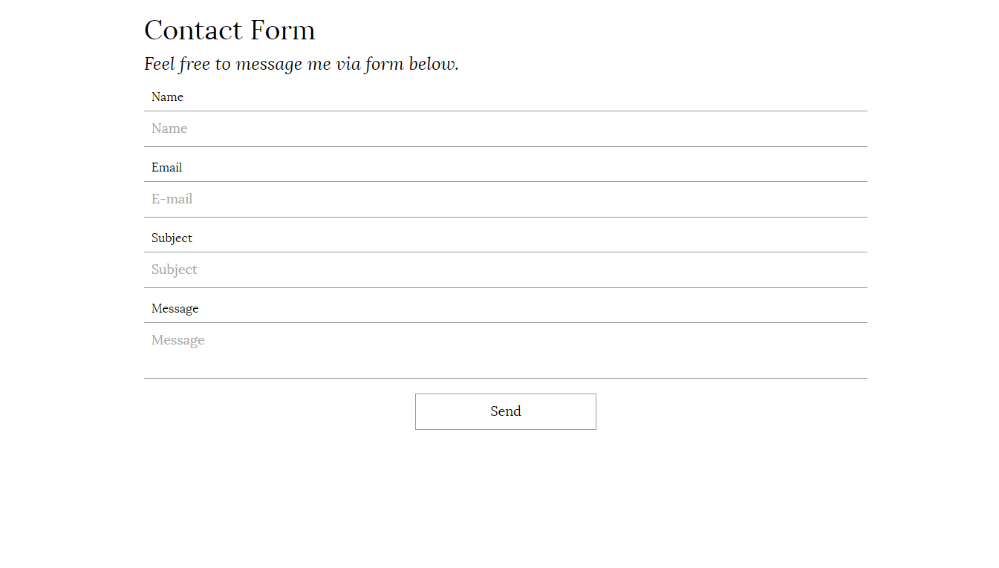

# Contact Form

This contact form is inspired by [Clean Blog](http://startbootstrap.com/template-overviews/clean-blog/) template.

## Installation

1. Download this repository
2. Copy files to your project
3. Include `reset.css` & `style.css` in `<head>` section and JavaScript files just before `</body>` in the same order as in my `index.html` file
4. Copy contact form code to the right place in your page
5. Change your e-mail address in `sendmail.php` file
6. Contact form is ready for use!

## Contributing

1. Fork it!
2. Create your feature branch: `git checkout -b my-new-feature`
3. Commit your changes: `git commit -am 'Add some feature'`
4. Push to the branch: `git push origin my-new-feature`
5. Submit a pull request

## History

- December 4, 2016: v. 1.0

## Protip

If you want test this form on your localhost, first configure your PHP and sendmail settings - check out tutorial on [Stack Overflow](http://stackoverflow.com/a/18185233).

## Credits

- Eric Meyer - [reset.css](http://meyerweb.com/eric/tools/css/reset/)

## License

Copyright (c) 2016 Wojtek Wernicki

Permission is hereby granted, free of charge, to any person obtaining a copy of this software and associated documentation files (the "Software"), to deal in the Software without restriction, including without limitation the rights to use, copy, modify, merge, publish, distribute, sublicense, and/or sell copies of the Software, and to permit persons to whom the Software is furnished to do so, subject to the following conditions:

The above copyright notice and this permission notice shall be included in all copies or substantial portions of the Software.

THE SOFTWARE IS PROVIDED "AS IS", WITHOUT WARRANTY OF ANY KIND, EXPRESS OR IMPLIED, INCLUDING BUT NOT LIMITED TO THE WARRANTIES OF MERCHANTABILITY, FITNESS FOR A PARTICULAR PURPOSE AND NONINFRINGEMENT. IN NO EVENT SHALL THE AUTHORS OR COPYRIGHT HOLDERS BE LIABLE FOR ANY CLAIM, DAMAGES OR OTHER LIABILITY, WHETHER IN AN ACTION OF CONTRACT, TORT OR OTHERWISE, ARISING FROM, OUT OF OR IN CONNECTION WITH THE SOFTWARE OR THE USE OR OTHER DEALINGS IN THE SOFTWARE.